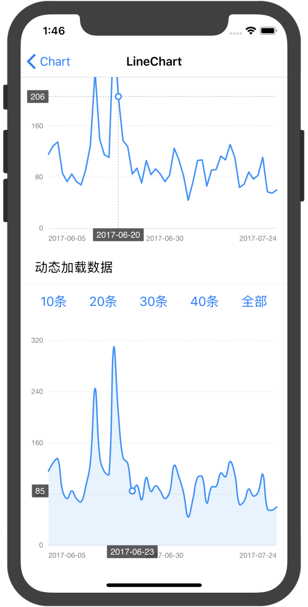
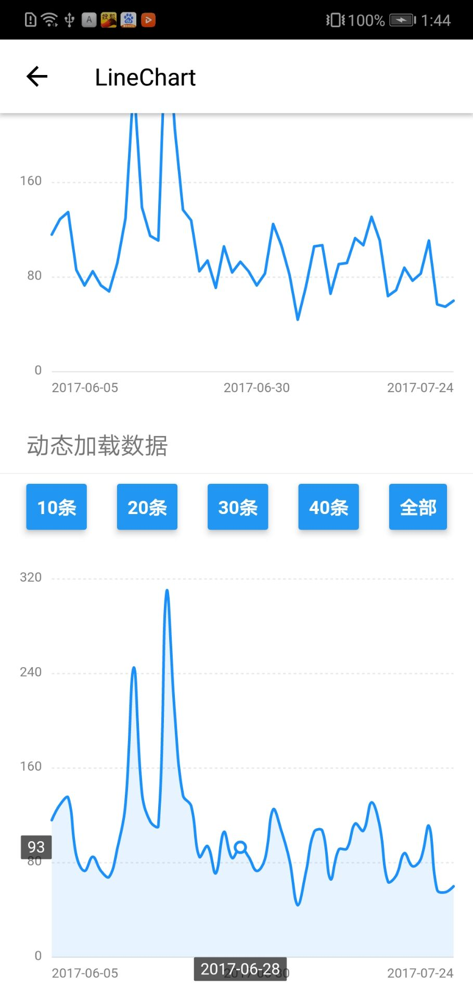

# react-native-f2chart

[F2](https://antv.alipay.com/zh-cn/f2/3.x/index.html) charts for react-native

 

## install

1、

```
yarn add react-native-f2chart or npm i react-native-f2chart
```

2、 copy `node_moules/react-native-f2chart/src/f2chart.html` to `android/app/src/main/assets/f2chart.html`

simple demo [example](example)

## usage

```js
import Chart from "react-native-f2chart";

// 参考 https://antv.alipay.com/zh-cn/f2/3.x/demo/line/basic.html
const initScript = data =>`
(function(){
    chart =  new F2.Chart({
        id: 'chart',
        pixelRatio: window.devicePixelRatio,
    });
    chart.source(${JSON.stringify(data)}, {
    value: {
    tickCount: 5,
    min: 0
    },
    date: {
    type: 'timeCat',
    range: [0, 1],
    tickCount: 3
    }
    });
    chart.tooltip({
    custom: true,
    showXTip: true,
    showYTip: true,
    snap: true,
    onChange: function(obj) {
        window.postMessage(stringify(obj))
    },
    crosshairsType: 'xy',
    crosshairsStyle: {
    lineDash: [2]
    }
    });
    chart.axis('date', {
    label: function label(text, index, total) {
    var textCfg = {};
    if (index === 0) {
        textCfg.textAlign = 'left';
    } else if (index === total - 1) {
        textCfg.textAlign = 'right';
    }
    return textCfg;
    }
    });
    chart.line().position('date*value');
    chart.render();
})();
`;

    ...
    render() {
        return (
            <View style={{ height: 350 }}>
              <Chart initScript={initScript(data)} />
            </View>
        )
    }
    ...
`
```

## Props

| Prop         | type          | Description                                                                                 | Required |
| ------------ | ------------- | ------------------------------------------------------------------------------------------- | -------- |
| `initScript` | string        | 初始化图表的 js 代码，参考 f2 的文档                                                        | `yes`    |
| `data`       | Array<Object> | f2 chart source                                                                             | `no`     |
| `onChange`   | Function      | tooltip onchange                                                                            | `no`     |
| `webView`    | ReactElement  | 渲染图表的 webview，可以使用 react-native-webview 代替，默认使用 react-natve 里面的 webview | `no`     |

## Notice

- chart 已经在源码的 html 定义过了，在 `initScript` 中，并不需要定义 chart，直接给 chart 赋值即可
- tooltip onchange 中 传输数据时用到的 `stringify` 也是在 html 定义好的，可以直接使用，用 `JSON.stringify` 会报错, [原因](https://developer.mozilla.org/en-US/docs/Web/JavaScript/Reference/Errors/Cyclic_object_value)
- 如果使用的是 `react-native-webview`，在 tooltip 中的 `postMessage` 应该为 `window.ReactNativeWebView.postMessage`
